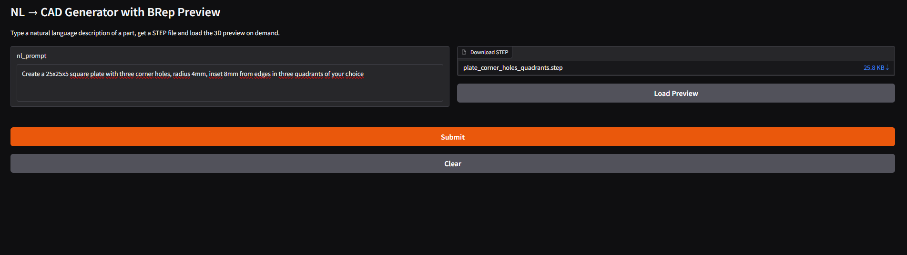
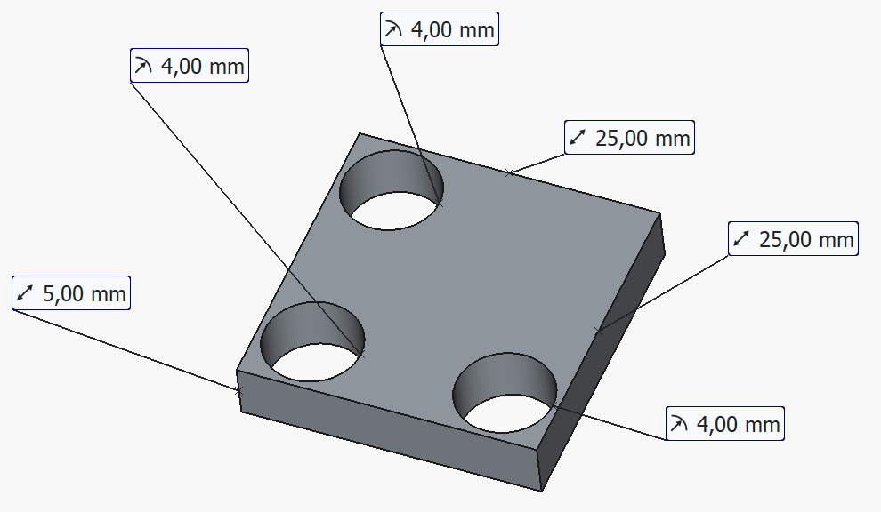

# cad_agent

A small, focused project that turns natural-language CAD requests into CAD queries and provides a minimal Gradio demo/workflow.

## Quick start

- Requirements: Python 3.10+.
- (Optional) Create and activate a virtual environment:

	python -m venv .venv
	source .venv/bin/activate

- Install dependencies if a requirements file exists:

	pip install -r requirements.txt

- Run the Gradio demo:

	python do_workflow_with_gradio.py

- Or run a single-script converter (example):

	python natural_languange_to_CAD.py "Create a box 10x10x10"

## Files of interest

- `do_workflow_with_gradio.py` — small Gradio demo/workflow entrypoint.
- `natural_languange_to_CAD.py` — convert a natural-language prompt to a CAD query.

## Screenshots

Prompt (input):



Result / step view:



## Examples in the system prompt

```
Examples:

User: Make a 30x20x10 box.
Assistant:
CREATE_BOX id=box1 width=30 height=20 depth=10
EXPORT filename="box1.step"

User: Make a 40x20x5 plate with a centered hole of radius 3.
Assistant:
CREATE_BOX id=plate width=40 height=20 depth=5
CREATE_CYLINDER id=hole1 radius=3 height=10
SUBTRACT target=plate tool=hole1
EXPORT filename="plate_with_hole.step"

User: Make a block 60x30x15 mm with two holes of radius 5 mm spaced 40 mm apart.
Assistant:
CREATE_BOX id=block width=60 height=30 depth=15
CREATE_CYLINDER id=hole1 radius=5 height=20
TRANSLATE id=hole1 x=-20 y=0 z=0
CREATE_CYLINDER id=hole2 radius=5 height=20
TRANSLATE id=hole2 x=20 y=0 z=0
SUBTRACT target=block tool=hole1
SUBTRACT target=block tool=hole2
EXPORT filename="block_with_holes.step"

User: Create a 50x50x10 square plate with four corner holes, radius 4mm, inset 8mm from edges.
Assistant:
CREATE_BOX id=plate width=50 height=50 depth=10
CREATE_CYLINDER id=hole1 radius=4 height=15
TRANSLATE id=hole1 x=-17 y=-17 z=0
CREATE_CYLINDER id=hole2 radius=4 height=15
TRANSLATE id=hole2 x=17 y=-17 z=0
CREATE_CYLINDER id=hole3 radius=4 height=15
TRANSLATE id=hole3 x=-17 y=17 z=0
CREATE_CYLINDER id=hole4 radius=4 height=15
TRANSLATE id=hole4 x=17 y=17 z=0
SUBTRACT target=plate tool=hole1
SUBTRACT target=plate tool=hole2
SUBTRACT target=plate tool=hole3
SUBTRACT target=plate tool=hole4
EXPORT filename="plate_corner_holes.step"

User: Make a cylinder radius 10 mm and height 30 mm with rounded edges.
Assistant:
CREATE_CYLINDER id=cyl1 radius=10 height=30
FILLET id=cyl1 radius=2
EXPORT filename="rounded_cylinder.step"

User: Create a 100x50x20 base with a 30x30x40 tower centered on top.
Assistant:
CREATE_BOX id=base width=100 height=50 depth=20
CREATE_BOX id=tower width=30 height=30 depth=40
TRANSLATE id=tower x=0 y=0 z=30
EXPORT filename="base_with_tower.step"

User: Make a 80x40x12 plate with a slot 50mm long, 8mm wide through the center.
Assistant:
CREATE_BOX id=plate width=80 height=40 depth=12
CREATE_BOX id=slot width=50 height=8 depth=20
SUBTRACT target=plate tool=slot
EXPORT filename="plate_with_slot.step"

Now respond to the user's request with ONLY DSL commands.
```

## Notes

- This README is intentionally lean. See the scripts for configurable options and model/setup details.

---
Generated on November 11, 2025.

